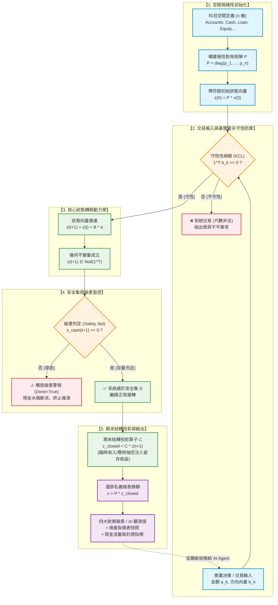

# 會計水流系統與矩陣代數數學模型說明書
Accounting Fluid System & Matrix-Algebraic Model Specification

---

## 1. 核心架構與概念映射 (Conceptual Mapping)

將複式記賬（Double-Entry Bookkeeping）視為**有向流網絡（Directed Flow Network）**，各實體與物理/數學概念的映射關係如下：

| 會計概念 (Accounting) | 水流模型 (Fluid Metaphor) | 拓撲 / 圖論 (Graph Theory) | 線性代數 (Linear Algebra) |
| :--- | :--- | :--- | :--- |
| **會計科目 (Account)** | 蓄水槽 / 水箱 (Water Tank) | 節點 (Node $v_i \in V$) | 標準正交基底向量 $e_i \in \mathbb{R}^n$ |
| **科目餘額 (Account Balance)** | 水箱當前蓄水量 / 水位 | 節點勢能 / 存量 (Stock) | 狀態向量 $x \in \mathbb{R}^n$ |
| **交易 (Transaction)** | 水流傳輸事件 (Flow Event) | 有向超邊 (Directed Hyperedge) | 關聯向量 $b_k \in \mathbb{R}^n$ 乘金額 $a_k$ |
| **批次交易 (Journal / Ledger)** | 管網傳輸配置 (Pipe Network) | 有向關聯矩陣 (Incidence Matrix) | 交易矩陣 $B \in \mathbb{R}^{n \times m}$ |
| **借 / 貸 (Debit / Credit)** | 相對於水槽極性的流入/流出 | 流量代數符號 ($+/-$) | 符號乘積 $\operatorname{sgn}(\Delta x_i \cdot p_i)$ |
| **試算平衡 (Trial Balance)** | 系統質量 / 水量封閉守恆 | 基爾霍夫電流定律 (KCL) | 零和正交約束 $\mathbf{1}^T z = 0$ |
| **損益結轉 (Closing Entries)** | 臨時槽水流排空至留存收益槽 | 子空間降維投影 (Projection) | 結轉投影矩陣 $C \in \mathbb{R}^{n \times n}$ |

---

## 2. 嚴格數學形式化定義 (Formal Mathematical Formulation)

### 2.1 賬戶空間與狀態向量
設整個賬套包含 $n$ 個會計科目，賬戶索引集為 $I = \{1, 2, \dots, n\}$。
系統在時間步 $t$ 的**名義餘額向量（Unsigned Balance Vector）**定義為：
$$x(t) = \begin{bmatrix} x_1(t) \\ x_2(t) \\ \vdots \\ x_n(t) \end{bmatrix} \in \mathbb{R}^n_{\ge 0}$$

### 2.2 科目極性對角矩陣 (Account Polarity Matrix)
定義極性矩陣 $P \in \{-1, +1\}^{n \times n}$ 為對角矩陣：
$$P = \operatorname{diag}(p_1, p_2, \dots, p_n)$$

極性由會計科目的自然正常餘額方向決定（Normal Balance）：
$$p_i = \begin{cases} 
+1, & \text{若科目為 借方常態 (Debit-normal: Asset 資産, Expense 費用)} \\
-1, & \text{若科目為 貸方常態 (Credit-normal: Liability 負債, Equity 權益, Revenue 收入)}
\end{cases}$$

### 2.3 帶符號餘額向量 (Signed Balance Vector)
為了代數運算的簡潔性與對稱性，定義系統的帶符號餘額向量 $z(t)$：
$$z(t) = P \cdot x(t)$$
* 當 $z_i > 0$：表示該科目具有淨借方餘額（Net Debit Balance）。
* 當 $z_i < 0$：表示該科目具有淨貸方餘額（Net Credit Balance）。

### 2.4 交易關聯矩陣與狀態轉移方程式 (State Transition Equation)
設第 $k$ 筆交易流動事件的金額為標量 $a_k \in \mathbb{R}_{>0}$，其在帶符號空間的流動關聯向量為 $b_k \in \mathbb{R}^n$。

根據複式記賬原則（有借必有貸，借貸必相等），關聯向量必須嚴格滿足零和約束：
$$\mathbf{1}^T b_k = \sum_{i=1}^n b_{k, i} = 0$$

若在一段計量區間內發生了 $m$ 筆交易，將其組合為關聯矩陣 $B \in \mathbb{R}^{n \times m}$ 與交易金額向量 $a \in \mathbb{R}^m_{>0}$：
$$B = \begin{bmatrix} b_1 & b_2 & \dots & b_m \end{bmatrix}, \quad a = \begin{bmatrix} a_1 \\ a_2 \\ \vdots \\ a_m \end{bmatrix}$$

**系統的動態狀態轉移方程**寫作：
$$z(t+1) = z(t) + B \cdot a$$

轉換回報表端名義餘額：
$$x(t+1) = P^{-1} \cdot z(t+1) = P \cdot z(t+1) \quad (\text{因 } P = P^{-1})$$

---

## 3. 試算平衡與守恆律的代數證明 (Conservation Proof)

### 3.1 關聯矩陣的零和引理
由於每一列 $b_k$ 均滿足 $\mathbf{1}^T b_k = 0$，則全矩陣乘全 1 轉置向量恆為零向量：
$$\mathbf{1}^T B = \begin{bmatrix} \mathbf{1}^T b_1 & \mathbf{1}^T b_2 & \dots & \mathbf{1}^T b_m \end{bmatrix} = \mathbf{0}^T$$

### 3.2 試算平衡（基爾霍夫電流定律 KCL）的不變量定理
**定理**：若初始狀態滿足試算平衡 $\mathbf{1}^T z(0) = 0$，則在任意有限步合法交易輸入後，系統始終恆定保持試算平衡：
$$\mathbf{1}^T z(t) = 0 \quad (\forall t \ge 0)$$

**證明**：
利用數學歸納法，由狀態方程兩側左乘 $\mathbf{1}^T$：
$$\mathbf{1}^T z(t+1) = \mathbf{1}^T \big( z(t) + B a \big) = \mathbf{1}^T z(t) + (\mathbf{1}^T B) a = \mathbf{1}^T z(t) + \mathbf{0}^T a = \mathbf{1}^T z(t)$$
得證不變量守恆：
$$\sum_{i=1}^n z_i(t) = 0 \iff \sum_{\text{Debit-normal}} x_i - \sum_{\text{Credit-normal}} x_i = 0$$
$$\implies \text{Assets} + \text{Expenses} = \text{Liabilities} + \text{Equity} + \text{Revenues}$$

---

## 4. 複合交易與超圖擴展 (Compound Transactions & Hypergraph)

在水流模型中：
* **簡單交易（一借一貸）**：對應標準有向圖的一條邊（Edge），從流出槽直接連到流入槽。
  $$b_k = [0, \dots, +1, \dots, -1, \dots, 0]^T$$
* **複合交易（一借多貸 / 多借多貸）**：普通圖的一條邊僅能連接兩個頂點，因此複合交易在數學上本質是**有向超圖（Directed Hypergraph）**的一條超邊（Hyperedge）。
  
### 範例：發放工資與代扣所得稅
* 借：管理費用（Expense） $10,000
* 貸：應交稅費（Liability） $2,000
* 貸：銀行存款（Asset） $8,000

此時超邊的標準化關聯向量為：
$$b_k = \begin{bmatrix} 
+1.0 & \text{(Expense: 借方流入)} \\ 
-0.2 & \text{(Liability: 貸方增加，帶符號值為負)} \\ 
-0.8 & \text{(Asset: 貸方流出，帶符號值為負)} 
\end{bmatrix}, \quad a_k = 10,000$$

驗證零和條件：
$$\mathbf{1}^T b_k = 1.0 - 0.2 - 0.8 = 0$$
超圖模型完全向下兼容所有複雜會計分錄。

---

## 5. 期末損益結轉算子 (Period-end Closing Operator)

收入（Revenue）和費用（Expense）屬於臨時科目（Temporary Accounts）。在會計期末，必須將其餘額清零並匯入留存收益（Retained Earnings，屬於 Equity）。

在水流模型中，這相當於**將臨時水箱的水抽空並注入主權益水箱**。

這可以形式化為一個線性投影矩陣 $C \in \mathbb{R}^{n \times n}$：
$$z_{\text{closed}} = C \cdot z$$

設 Retained Earnings 位於第 $r$ 行，所有臨時科目集合為 $J_{\text{temp}} \subset \{1, \dots, n\}$：
$$C_{i, j} = \begin{cases}
1, & i = j \text{ 且 } i \notin J_{\text{temp}} \\
0, & i = j \text{ 且 } i \in J_{\text{temp}} \quad (\text{清空臨時科目}) \\
1, & i = r \text{ 且 } j \in J_{\text{temp}} \quad (\text{臨時科目的帶符號值全數匯入 } r) \\
0, & \text{其他}
\end{cases}$$

由於每一列的和始終為 1（$\mathbf{1}^T C = \mathbf{1}^T$），該結轉算子也是嚴格保持系統總和不變的自同態映射。

---

## 6. 具體數值演示 (Numerical Walkthrough)

### 賬戶列表 ($n=5$)
1. `Cash` (Asset, $p_1 = +1$)
2. `Inventory` (Asset, $p_2 = +1$)
3. `Bank Loan` (Liability, $p_3 = -1$)
4. `Common Stock` (Equity, $p_4 = -1$)
5. `Sales Revenue` (Revenue, $p_5 = -1$)

極性對角矩陣：
$$P = \operatorname{diag}(+1, +1, -1, -1, -1)$$

初始狀態 $x(0) = \mathbf{0} \implies z(0) = \mathbf{0}$。

### 發生三筆交易 ($m=3$)：
1. **創始人股權投資 $100,000**
   * 借：Cash $100,000；貸：Common Stock $100,000
   * $b_1 = [+1, 0, 0, -1, 0]^T, \quad a_1 = 100,000$
2. **銀行貸款 $50,000**
   * 借：Cash $50,000；貸：Bank Loan $50,000
   * $b_2 = [+1, 0, -1, 0, 0]^T, \quad a_2 = 50,000$
3. **現銷商品獲取收入 $30,000**
   * 借：Cash $30,000；貸：Sales Revenue $30,000
   * $b_3 = [+1, 0, 0, 0, -1]^T, \quad a_3 = 30,000$

### 構建交易矩陣 $B$ 與金額向量 $a$：
$$B = \begin{bmatrix}
+1 & +1 & +1 \\
 0 &  0 &  0 \\
 0 & -1 &  0 \\
-1 &  0 &  0 \\
 0 &  0 & -1
\end{bmatrix}, \quad a = \begin{bmatrix} 100,000 \\ 50,000 \\ 30,000 \end{bmatrix}$$

計算狀態變化量 $\Delta z = B \cdot a$：
$$\Delta z = \begin{bmatrix}
100,000 + 50,000 + 30,000 \\
0 \\
-50,000 \\
-100,000 \\
-30,000
\end{bmatrix} = \begin{bmatrix} +180,000 \\ 0 \\ -50,000 \\ -100,000 \\ -30,000 \end{bmatrix}$$

檢驗試算平衡：
$$\mathbf{1}^T \Delta z = 180,000 + 0 - 50,000 - 100,000 - 30,000 = 0 \quad (\text{完全守恆})$$

還原報表名義餘額 $x = P \cdot z$：
$$x = \begin{bmatrix}
+1 \cdot (+180,000) \\
+1 \cdot (0) \\
-1 \cdot (-50,000) \\
-1 \cdot (-100,000) \\
-1 \cdot (-30,000)
\end{bmatrix} = \begin{bmatrix}
180,000 & (\text{現金資產}) \\
0 & (\text{存貨資產}) \\
50,000 & (\text{銀行貸款負債}) \\
100,000 & (\text{普通股權益}) \\
30,000 & (\text{銷售收入})
\end{bmatrix}$$

---

## 7. Python 最小原型實現 (Minimal Python Prototype)

已在同目錄下提供可直接執行的零依賴驗證腳本：[accounting_fluid_demo.py](file:///Users/kaifenchang/Library/Mobile%20Documents/com~apple~CloudDocs/acc/accounting_fluid_demo.py)。

```python
from typing import List

class AccountingFluidSystem:
    def __init__(self, accounts: List[str], polarities: List[int]):
        """
        :param accounts: 科目名稱列表
        :param polarities: 各科目極性 (+1: 借方常態, -1: 貸方常態)
        """
        assert len(accounts) == len(polarities), "科目數量與極性數量必須一致"
        self.accounts = accounts
        self.n = len(accounts)
        self.account_idx = {name: i for i, name in enumerate(accounts)}
        self.polarities = polarities  # P 對角線元素
        self.z = [0.0] * self.n       # 帶符號狀態向量 (Signed Balance Vector)

    def execute_batch(self, B: List[List[float]], a: List[float]):
        """
        執行批次交易矩陣乘法: z(t+1) = z(t) + B @ a
        :param B: 關聯矩陣 (n x m)
        :param a: 交易金額向量 (m,)
        """
        m = len(a)
        # 1. 檢驗基爾霍夫電流定律 (KCL) / 每筆交易借貸相等: 每列之和為 0
        for col_idx in range(m):
            col_sum = sum(B[row_idx][col_idx] for row_idx in range(self.n))
            assert abs(col_sum) < 1e-6, f"交易 #{col_idx+1} 不平衡! 每列和必須為 0"

        # 2. 狀態轉移: Delta_z = B @ a
        for row_idx in range(self.n):
            delta_i = sum(B[row_idx][col_idx] * a[col_idx] for col_idx in range(m))
            self.z[row_idx] += delta_i

        # 3. 系統全局試算平衡檢驗: 1^T z = 0
        assert abs(sum(self.z)) < 1e-6, "系統試算平衡被破壞!"

    def get_nominal_balances(self) -> List[float]:
        """還原為會計報表端無符號名義餘額 x = P @ z"""
        return [self.polarities[i] * self.z[i] for i in range(self.n)]

    def close_temporary_accounts(self, temp_accounts: List[str], retained_earnings_acc: str):
        """損益結轉算子 C: 將臨時科目清零，並全數匯入留存收益"""
        r_idx = self.account_idx[retained_earnings_acc]
        temp_indices = {self.account_idx[name] for name in temp_accounts}
        
        transferred = 0.0
        for idx in temp_indices:
            transferred += self.z[idx]
            self.z[idx] = 0.0
            
        self.z[r_idx] += transferred
        assert abs(sum(self.z)) < 1e-6, "結轉後試算平衡破壞!"

    def display_trial_balance(self, title="試算平衡表 (Trial Balance)"):
        nominal = self.get_nominal_balances()
        print(f"\n=== {title} ===")
        print(f"{'科目 (Account)':<20} | {'借方 (Debit)':<15} | {'貸方 (Credit)':<15}")
        print("-" * 56)
        total_debit, total_credit = 0.0, 0.0
        for i, name in enumerate(self.accounts):
            val = nominal[i]
            if self.z[i] >= 0:
                print(f"{name:<20} | {val:<15.2f} | {'':<15}")
                total_debit += val
            else:
                print(f"{name:<20} | {'':<15} | {val:<15.2f}")
                total_credit += val
        print("-" * 56)
        print(f"{'合計 (Total)':<20} | {total_debit:<15.2f} | {total_credit:<15.2f}\n")
```

---

## 8. 理論依據與延伸應用 (Theoretical Grounding & Extensions)

1. **圖論與網路流 (Graph Theory & Network Flow)**：
   * 會計學本質是全零和網絡流（Zero-sum Network Flow）。
   * 賬戶為有向圖節點，交易為有向超邊。
2. **基爾霍夫電流定律 (Kirchhoff's Current Law, KCL)**：
   * 複式記賬的「借貸必相等」就是電流節點守恆定律的直接離散形式。
3. **稀疏矩陣高效計算 (Sparse Matrix Optimization)**：
   * 在真實企業中，科目可能有上萬個，但單筆交易通常只牽涉 2 到 5 個科目。因此矩陣 $B$ 具備極高的稀疏性（Sparsity $> 99.9\%$），非常適合使用 CSR (Compressed Sparse Row) 或 CSC 格式進行並行加速計算。
4. **形式化驗證 (Formal Verification)**：
   * 透過保證矩陣操作位於 $\operatorname{Null}(\mathbf{1}^T)$ 零空間內，可在編譯期或架構層徹底杜絕因並發、死鎖或浮點誤差導致的「賬目不平衡」問題。

---

## 9. 底層數學結構深度剖析 (Deep Mathematical Foundations)

對於數學與控制理論背景的研究者，該模型在現代數學體系中有著嚴格的幾何與代數對應：

### 9.1 幾何本質：不變超平面 (Invariant Hyperplane)
在帶符號座標系 $z(t) = P \cdot x(t)$ 中，會計的「試算平衡（借貸守恆）」在幾何上並非單純的數值檢查，而是**系統狀態流形被拘束在一個特定的子空間內**。

全系統的約束條件：
$$\mathbf{1}^T z(t) = \sum_{i=1}^n z_i(t) = 0$$

這意味著：**系統在任何時刻的狀態向量 $z(t)$，都嚴格位於 $\mathbb{R}^n$ 中一個維度為 $n-1$ 的閉合超平面（Hyperplane）上**：
$$\mathcal{H} = \operatorname{Null}(\mathbf{1}^T) = \{ z \in \mathbb{R}^n \mid \mathbf{1}^T z = 0 \}$$

### 9.2 交易流動：圖與超圖的關聯向量 (Incidence Vectors)
每筆交易是超平面 $\mathcal{H}$ 上的一個微擾位移向量：
$$\Delta z_k = b_k \cdot a_k$$

* **標準一借一貸交易（有向圖的邊）**：
  若資金自科目 $j$ 流向科目 $i$（借記 $i$，貸記 $j$）：
  $$b_k = e_i - e_j \quad (e_i, e_j \text{ 為標準正交基底向量})$$
  顯然 $\mathbf{1}^T (e_i - e_j) = 1 - 1 = 0$。在圖論中，$b_k$ 就是有向圖**關聯矩陣（Incidence Matrix）的一列**。
* **複合交易（有向超圖的超邊 Hyperedge）**：
  若為一借多貸或多借多貸，各支路依照權重比例分流：
  $$b_k = e_i - \sum_{j} w_j e_j, \quad \text{其中 } \sum w_j = 1$$
  依舊滿足 $\mathbf{1}^T b_k = 0$。

當計量區間發生 $m$ 筆交易時，組裝成關聯矩陣 $B \in \mathbb{R}^{n \times m}$，其核心代數特徵為：
$$\mathbf{1}^T B = \mathbf{0}^T \implies \operatorname{Col}(B) \subseteq \operatorname{Null}(\mathbf{1}^T)$$

### 9.3 離散時間 LTI 動力系統與不變量定理 (Invariance Theorem)
會計系統是一個標準的離散時間線性非時變系統（LTI System）：
$$z(t+1) = z(t) + B \cdot a(t)$$

**【不變量定理證明】**：
若系統初始狀態滿足 $z(0) \in \mathcal{H}$，則在任意控制輸入序列 $a(t)$ 驅動下，系統狀態軌跡恆定保持在超平面內：
$$\forall t \ge 0, \quad z(t) \in \mathcal{H}$$

**證明**：
在轉移方程兩端左乘全 1 向量轉置：
$$\mathbf{1}^T z(t+1) = \mathbf{1}^T \big( z(t) + B a(t) \big) = \mathbf{1}^T z(t) + (\mathbf{1}^T B) a(t) = \mathbf{1}^T z(t) + \mathbf{0}^T a(t) = \mathbf{1}^T z(t)$$
由數學歸納法，只要初始 $\mathbf{1}^T z(0) = 0$，則系統對一切 $t$ 恆有 $\mathbf{1}^T z(t) = 0$。

### 9.4 期末結算：冪等投影算子 (Idempotent Projection Operator $C$)
期末損益結轉是將臨時科目維度（收入、費用）壓縮清零，並全數匯聚至實科目留存收益（下標 $r$）：
$$z_{\text{closed}} = C \cdot z$$

矩陣 $C \in \mathbb{R}^{n \times n}$ 具有兩大幾何特性：
1. **冪等性 (Idempotence)**：
   $$C^2 = C$$
   即 $C$ 是一個標準的線性投影算子。對已完成結轉的狀態再次執行結轉，系統保持不變。
2. **保和性 (Conservation)**：
   $$\mathbf{1}^T C = \mathbf{1}^T \implies \mathbf{1}^T (C z) = \mathbf{1}^T z = 0$$
   抽水與注入完全封閉，不產生任何系統數值耗散。

---

## 10. AI 小型世界模型推演架構 (AI World Model & Trajectory Simulation)

將上述數學引擎封裝為**沙盒環境（Environment）**後，上層 AI 算法即可進行商業決策推演。可執行代碼參見：[accounting_world_model_ai.py](file:///Users/kaifenchang/Library/Mobile%20Documents/com~apple~CloudDocs/acc/accounting_world_model_ai.py)。

### 10.1 破產防護約束與安全集 (Safety Set)
在狀態空間 $\mathcal{H}$ 中，定義企業的**安全運行集合（Safety Set）** $\mathcal{S}$：
$$\mathcal{S} = \{ z \in \mathcal{H} \mid z_{\text{cash}} \ge 0 \}$$
若狀態軌跡脫離安全集（$z \notin \mathcal{S}$），即代表企業發生現金斷流（破產）。

### 10.2 受約束的軌跡可達性 (Constrained Reachability)
給定一個未來的管理決策序列 $u = [a(1), a(2), \dots, a(T)]$，世界模型推進離散軌跡：
$$z(t+1) = C \big( z(t) + B(u(t)) a(u(t)) \big)$$

AI 決策算法的核心目標是求解**最優控制問題（Optimal Control）**：
$$u^* = \arg\max_{u \in \mathcal{U}} z_{\text{equity}}(T) \quad \text{s.t.} \quad z(t) \in \mathcal{S}, \quad \forall t \in [1, T]$$

* **策略 A（激進擴張）**：因前期資本支出過大，在 $t=2$ 時 $z(2) \notin \mathcal{S}$，算法觸發破產警報並剪枝。
* **策略 B（穩健保守）**：軌跡始終處於安全集內部，且終點權益最大化，被 AI 判定為最優可行路徑。

---

## 11. 核心引擎架構與運作流程圖 (Engine Architecture Flowchart)

以下為整個會計物理引擎（Accounting Engine）的代數流水線與狀態機閉環流程：




